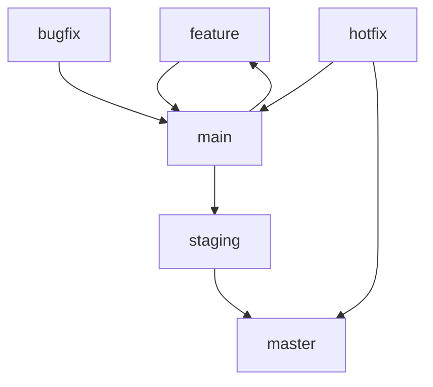
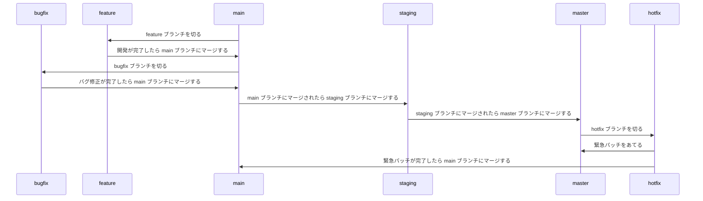

# GitHub 運用

## ブランチ

ブランチは基本的に以下のように分けて運用する。

| ブランチ名 | 用途             |
| ---------- | ---------------- |
| main       | 開発             |
| staging    | 検証             |
| master     | 本番             |
| feature    | 機能追加         |
| hotfix     | 致命的なバグ修正 |
| bugfix     | バグ修正         |

### ブランチの種類

#### main

開発用のブランチ。

基本的にこのブランチから feature ブランチを切って開発を行う。

#### staging

検証用のブランチ。

本番に忠実なため、開発者やクライアントが検証するためのブランチ。

#### master

本番用のブランチ。

#### feature

機能追加用のブランチ。

main ブランチから切って開発を行う。

#### hotfix

致命的なバグ修正用のブランチ。

緊急パッチをあてる際使用する。

#### bugfix

バグ修正用のブランチ。

### ブランチの運用

main は開発用のブランチなので、基本的にはこのブランチから feature ブランチを切って開発を行う。
feature ブランチは開発が完了したら main ブランチにマージする。
main ブランチにマージされたら、staging ブランチにマージする。( サーバーへのリリースは GitHub Actions で行う )
staging ブランチにマージされたら、master ブランチにマージする。( サーバーへのリリースは GitHub Actions で行う )

以下の図のようにブランチを運用する。

